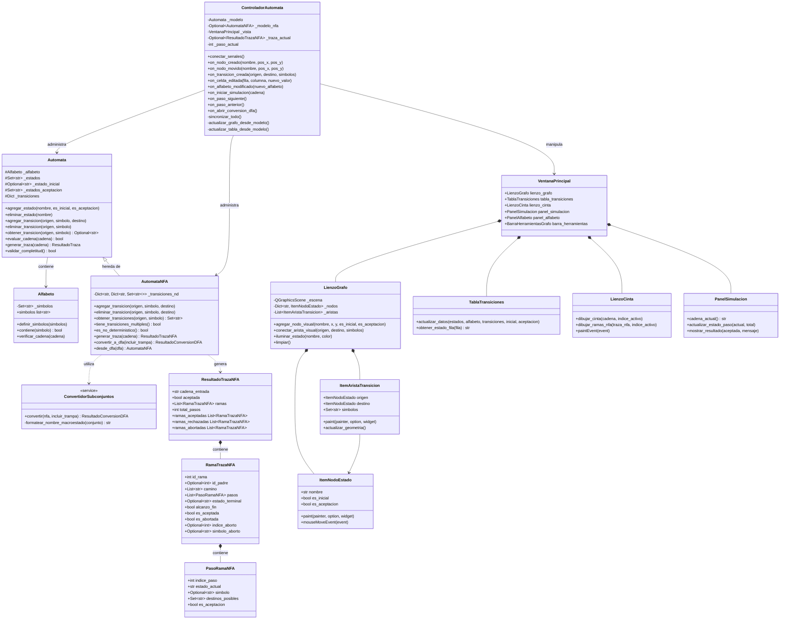
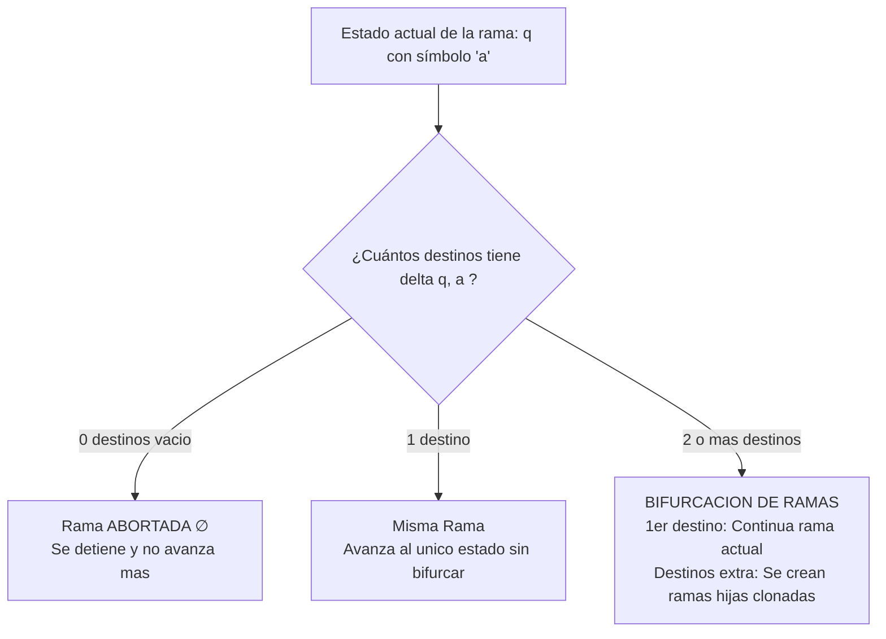

# Guía de Arquitectura y Diagrama de Clases — SimulaAutomata

Este documento explica de forma clara y pedagógica cómo está estructurado el proyecto **SimulaAutomata**, cómo se relacionan sus clases bajo el patrón **Modelo-Vista-Controlador (MVC)** y la lógica detrás de la simulación y ramificación de autómatas.

---

## 1. Visión General de la Arquitectura (MVC)

El proyecto separa estrictamente las responsabilidades en tres capas:

1. **Modelo (`src/model/`)**: Contiene la lógica matemática formal de los autómatas (5-tuplas, alfabetos $\Sigma$, transiciones $\delta$, autómatas deterministas DFA, no deterministas NFA, cálculo de ramas y algoritmo de conversión por subconjuntos). No sabe nada de interfaces gráficas.
2. **Vista (`src/view/`)**: Implementa la interfaz gráfica con **PyQt6** (lienzo interactivo para dibujar estados y transiciones estilo Draw.io/Figma, matriz de transiciones editable, cinta de simulación con llave superior y paneles de control).
3. **Controlador (`src/controller/`)**: Es el "puente" u orquestador. Captura las acciones del usuario en la Vista, actualiza el Modelo y sincroniza todos los componentes visuales en tiempo real de forma bidireccional.

```mermaid
flowchart LR
    subgraph VISTA [Capa Vista (PyQt6)]
        VP[VentanaPrincipal]
        LG[LienzoGrafo]
        TT[TablaTransiciones]
        LC[LienzoCinta]
        PS[PanelSimulacion]
    end

    subgraph CONTROLADOR [Capa Controlador]
        CTRL[ControladorAutomata]
    end

    subgraph MODELO [Capa Modelo]
        AUT[Automata DFA]
        NFA[AutomataNFA]
        ALF[Alfabeto]
        CONV[ConvertidorSubconjuntos]
    end

    VP --> CTRL
    LG --> CTRL
    TT --> CTRL
    PS --> CTRL
    
    CTRL -->|Modifica y consulta| AUT
    CTRL -->|Modifica y consulta| NFA
    CTRL -->|Modifica y consulta| ALF
    CTRL -->|Ejecuta conversion| CONV
    
    CTRL -->|Actualiza UI| VP
    CTRL -->|Redibuja| LG
    CTRL -->|Actualiza celdas| TT
    CTRL -->|Pinta traza/ramas| LC
```

---

## 2. Diagrama de Clases Completo (UML)



---

## 3. Explicación de Cada Componente

### A. Capa Modelo (`src/model/`)
* **`Alfabeto`**: Administra el conjunto de símbolos válidos $\Sigma$. Valida que los símbolos sean caracteres únicos y no repetidos, y comprueba que las cadenas de entrada solo contengan caracteres de $\Sigma$.
* **`Automata` (DFA)**: Representa el autómata determinista clásico. En un DFA, para cada estado $q$ y símbolo $a$, existe **a lo sumo un único estado destino** $\delta(q, a) \in Q$.
* **`AutomataNFA`**: Extiende a `Automata`. En lugar de guardar un destino único, almacena un **conjunto de destinos**:
  $$\delta: Q \times \Sigma \to \mathcal{P}(Q)$$
  Es el encargado de calcular las ramas computacionales al simular cadenas.
* **`ConvertidorSubconjuntos`**: Implementa el algoritmo de Rabin-Scott (construcción de subconjuntos) para transformar cualquier NFA con ramas múltiples en un DFA determinista equivalente.
* **`PasoRamaNFA`, `RamaTrazaNFA`, `ResultadoTrazaNFA`**: Clases de datos (`dataclass`) que guardan el árbol de simulación: identificador de la rama, rama padre de la que nació, secuencia de estados visitados, si llegó a la celda de fin ($\equiv$) o si fue abortada por falta de transición ($\emptyset$).

---

### B. Capa Vista (`src/view/`)
* **`VentanaPrincipal`**: Ventana Qt que organiza la pantalla en paneles ajustables (*QSplitter*).
* **`LienzoGrafo`**: Implementa `QGraphicsView` y `QGraphicsScene` con cuadrícula de puntos suave. Permite hacer clic para crear estados, arrastrar nodos y trazar líneas elásticas para conectar transiciones.
* **`ItemNodoEstado`**: Objeto gráfico del nodo circular. Se dibuja con doble círculo concéntrico si es de aceptación, y con una flecha entrante "inicio" si es el estado inicial.
* **`ItemAristaTransicion`**: Flecha que conecta dos estados. Si el estado se conecta a sí mismo, dibuja un arco curvo superior (*self-loop*). Si hay transiciones de ida y vuelta ($q_0 \to q_1$ y $q_1 \to q_0$), calcula curvas de Bézier cúbicas para que las flechas nunca se solapen.
* **`TablaTransiciones`**: Matriz editable donde las filas son los estados y las columnas son los símbolos del alfabeto.
* **`LienzoCinta`**: Dibuja la representación formal de la computación:
  * Nivel superior: La cinta de entrada con los símbolos, agrupada por la llave horizontal $\{$, el delimitador de fin $\equiv$ y el extremo abierto $\dots$.
  * Nivel inferior: Las cajas de la unidad de control que muestran el estado del autómata en cada momento, o las múltiples ramas si es un NFA.
* **`PanelSimulacion`**: Botones de "Paso anterior", "Paso siguiente", "Ejecutar todo" y selector de velocidad.

---

### C. Capa Controlador (`src/controller/`)
* **`ControladorAutomata`**:
  * Escucha las señales de la Vista (ej. cuando el usuario hace clic en el grafo, cuando mueve un nodo, o cuando escribe en una celda de la tabla).
  * Traduce la acción y actualiza el objeto `Automata` o `AutomataNFA`.
  * Realiza la **sincronización bidireccional**: si dibujas en el grafo, se actualiza la tabla de transiciones; si escribes en la tabla de transiciones, se actualizan las flechas en el grafo.
  * Controla la animación paso a paso iluminando el estado actual en color amarillo tanto en el grafo como en la cinta.

---

## 4. ¿Cómo Funciona la Lógica de las Ramas en el NFA?

Uno de los puntos clave del simulador es cómo se simula un NFA y cómo el programa decide **cuándo crear ramas nuevas (bifurcar), cuándo seguir en la misma rama y cuándo abortar**.

### El Algoritmo de Simulación (`generar_traza`)

La simulación se ejecuta símbolo por símbolo de la cadena de entrada:

1. **Inicio:**
   * Se inicia con **1 sola rama** (la rama raíz con `id_rama = 1`) ubicada en el estado inicial $q_0$.
   * La lista de `ramas_activas = [rama_raiz]`.

2. **Por cada símbolo $a$ de la cadena:**
   Para cada rama activa que está en un estado $q$:
   Se consulta la función de transición: $\text{destinos} = \delta(q, a)$.

   Aquí ocurren exactamente **3 casos posibles**:

   * **Caso 1: $\text{destinos} = \emptyset$ (No hay transición)**
     * **La rama muere (Se Aborta):** Se marca `es_abortada = True`, guardando el símbolo y paso exacto del aborto.
     * Esta rama **no continúa** para los siguientes símbolos. Se dibuja con el símbolo $\emptyset$ en rojo en la interfaz.

   * **Caso 2: Hay exactamente 1 destino ($\text{len(destinos)} == 1$)**
     * **No se sacan ramas nuevas:** La rama actual simplemente avanza a ese estado destino.
     * Se agrega el nuevo estado a su camino (`rama.camino.append(destino)`).

   * **Caso 3: Hay múltiples destinos ($\text{len(destinos)} > 1$) $\rightarrow$ ¡AQUÍ SE BIFURCA!**
     * Como el autómata es no determinista y puede estar en varios estados a la vez, **el camino se divide**:
     * El **primer destino** se lo queda la rama actual y continúa su avance.
     * Por **cada destino adicional**, el sistema crea una **nueva rama hija** (`RamaTrazaNFA`):
       * Se le asigna un nuevo identificador (`contador_ramas += 1`).
       * Se guarda quién fue su padre (`id_padre = rama.id_rama`).
       * Copia todo el historial de pasos que traía la rama padre hasta ese punto, y añade su propio destino alternativo.
       * Ambas ramas pasan a ser `ramas_activas` para el siguiente símbolo.



3. **Fin de la cadena (Llegada al delimitador $\equiv$):**
   * Cuando se leen todos los caracteres, se evalúan las ramas que **no fueron abortadas**:
   * Si el estado final de la rama está en el conjunto de estados de aceptación ($F$), la rama es **Aceptada** ($\checkmark$ verde).
   * Si el estado final no es de aceptación, la rama es **Rechazada** ($\times$ roja).
   * **Criterio formal de aceptación del NFA:** La cadena es aceptada si **al menos una** rama termina en aceptación.
