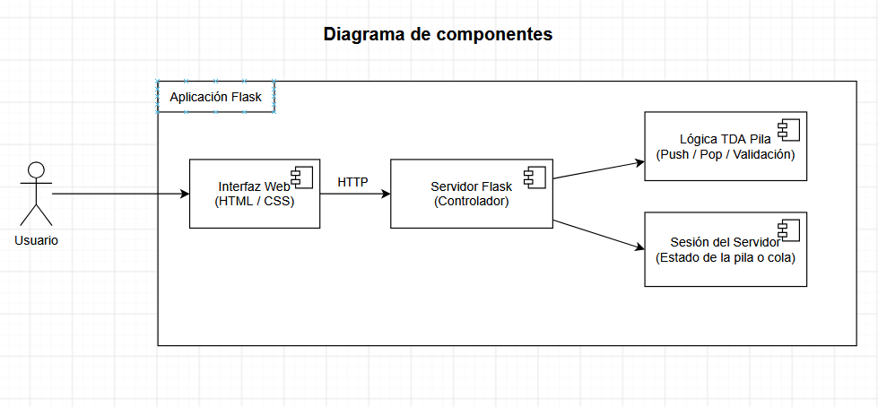
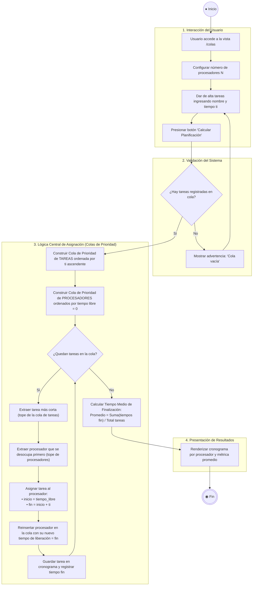

# Manual de Instalación y Ejecución

Aplicación web en **Python y Flask** que reúne los ejercicios de la materia. Desde la barra de navegación superior se puede cambiar entre ellos:

## 1. TDA Pila - Simulación de Equilibrado de Símbolos

Visualiza y simula el funcionamiento de una Pila en la verificación de balanceo de paréntesis, corchetes y llaves. Ruta: `/`.

## 2. Colas - Planificación de Tareas en Procesadores

Dado un conjunto de n tareas (cada una con un tiempo t<sub>i</sub>) y varios procesadores, calcula el orden de ejecución que **minimiza el tiempo medio de finalización**, usando dos colas de prioridad: una de tareas (ordenadas por t<sub>i</sub>, regla SPT) y otra de procesadores (ordenados por el instante en que quedan libres). Ruta: `/colas`. Funciones disponibles: dar de alta tarea, eliminar tarea, mostrar tareas, procesar (calcular la planificación) y salir (vaciar la cola).

---

### 1. Requisitos Previos

- **Python 3.8 o superior** instalado en el sistema ([python.org](https://www.python.org/)).
- **pip** (gestor de paquetes de Python, incluido por defecto con Python).

---

### 2. Pasos de Instalación

#### Paso 1: Abrir la terminal o línea de comandos

Navega hasta la carpeta raíz del proyecto:

```bash
cd "primera_tarea"
```

#### Paso 2 (Opcional pero recomendado): Crear y activar un entorno virtual

- **En Windows:**

  ```powershell
  python -m venv venv
  .\venv\Scripts\activate
  ```

- **En Linux / macOS:**
  ```bash
  python3 -m venv venv
  source venv/bin/activate
  ```

#### Paso 3: Instalar dependencias

Ejecuta el siguiente comando para instalar Flask:

```bash
pip install -r requirements.txt
```

---

### 3. Ejecución del Sistema

Ejecuta el archivo principal:

```bash
python app.py
```

Una vez ejecutado, verás en la consola un mensaje similar a:

```
* Running on http://127.0.0.1:5000
```

---

### 4. Acceso a la Aplicación

Abre tu navegador web e ingresa a:
👉 [http://localhost:5000](http://localhost:5000) o [http://127.0.0.1:5000](http://127.0.0.1:5000)

---

## 🏛️ Arquitectura y Diagramas del Sistema

### 1. Diagrama de Componentes (UML)

Estructura modular de la aplicación web y separación de responsabilidades:



---

### 2. Diagrama de Actividades - Colas y Planificación SPT (UML)

Flujo completo desde la interacción del usuario hasta la ejecución del algoritmo de asignación óptima con colas de prioridad (`heapq`):



