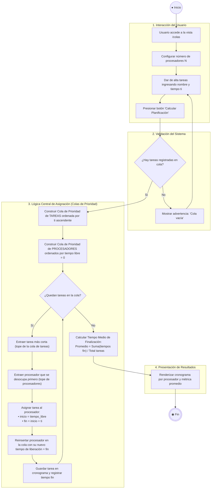

# Diagramas del Sistema - Ciencias de la Computación 3 (Tarea 1)

Este documento contiene los diagramas UML que describen la arquitectura y los flujos de ejecución de la aplicación.

---

## 1. Diagrama de Componentes (UML)

Muestra los componentes principales de la aplicación Flask, su interacción mediante HTTP y la gestión del estado en sesión:

---

## 2. Diagrama de Actividades - Planificación de Colas (UML)

Describe el flujo desde la interacción del usuario hasta el algoritmo de asignación óptima de tareas a procesadores (regla SPT con colas de prioridad `heapq`):

